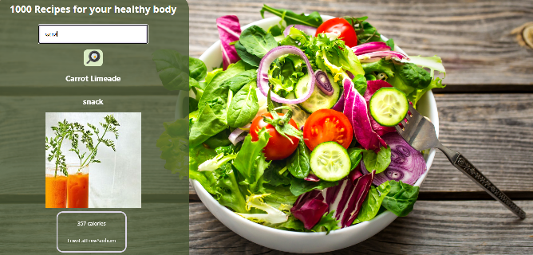

# 🥗 Recipe-App

A React application that allows users to search for healthy recipes using the Edamam Recipe Search API.

# DEMO:

Please open the app here: https://recipe-for-your-health.netlify.app/

## 📸 Preview



## 🚀 Features

- 🔍 Search for recipes by keyword
- 🍽 View detailed recipe info: ingredients, calories, meal type, diet labels
- 📱 Mobile responsive layout
- 🎨 Background image and modern UI styling

## 🛠 Technologies Used

- React
- CSS (with responsive design)
- Edamam API (free tier)

## 📦 Getting Started

### 1. Clone the Repository

```bash
git clone https://github.com/your-username/meal-plan.git
cd meal-plan

2. Install Dependencies
bash
Kopieren
Bearbeiten
npm install

3. Start the Application
bash
Kopieren
Bearbeiten
npm start
The app will run on http://localhost:3000

🔑 API Credentials
This app uses the Edamam API. You need to get your own App ID and App Key.

Go to Edamam Developer

Sign up and create a new application

Replace the app_id and app_key in the code (in App.js) with your own credentials:

js
Kopieren
Bearbeiten
const response = await fetch(`https://api.edamam.com/api/recipes/v2?type=public&q=${wordSubmitted}&app_id=YOUR_APP_ID&app_key=YOUR_APP_KEY`);
⚠️ Do not commit real API keys to public repositories.


📌 License This project is open-source and available under the MIT License.

This project was created as part of a learning exercise and is intended for educational use only.

Feel free to ask questions or suggest improvements!


